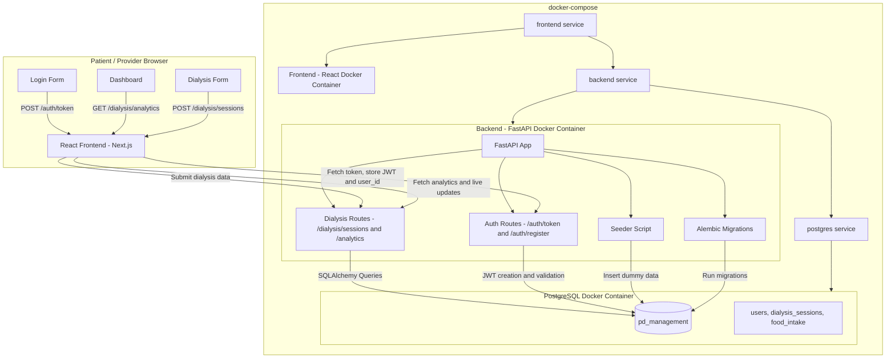

```mermaid

flowchart TD

    %% CLIENT SIDE
    subgraph ClientBrowser["Patient / Provider Browser"]
        LoginForm[Login Form]
        Dashboard[Dashboard]
        DialysisForm[Dialysis Form]
        UI[React Frontend - Next.js]

        LoginForm -->|POST /auth/token| UI
        Dashboard -->|GET /dialysis/analytics| UI
        DialysisForm -->|POST /dialysis/sessions| UI
    end

    %% FRONTEND CONTAINER
    subgraph Frontend["Frontend - React Docker Container"]
        UI
    end

    %% BACKEND CONTAINER
    subgraph Backend["Backend - FastAPI Docker Container"]
        API[FastAPI App]
        Auth[Auth Routes - /auth/token and /auth/register]
        Dialysis[Dialysis Routes - /dialysis/sessions and /analytics]
        Seeder[Seeder Script]
        Alembic[Alembic Migrations]

        API --> Auth
        API --> Dialysis
        API --> Seeder
        API --> Alembic
    end

    %% DATABASE CONTAINER
    subgraph Database["PostgreSQL Docker Container"]
        DB[(pd_management)]
        Tables[users, dialysis_sessions, food_intake]
    end

    %% CONNECTIONS
    UI -->|Fetch token, store JWT and user_id| Auth
    UI -->|Submit dialysis data| Dialysis
    UI -->|Fetch analytics and live updates| Dialysis
    Dialysis -->|SQLAlchemy Queries| DB
    Auth -->|JWT creation and validation| DB
    Seeder -->|Insert dummy data| DB
    Alembic -->|Run migrations| DB

    %% DOCKER COMPOSE
    subgraph DockerCompose["docker-compose"]
        frontendService[frontend service]
        backendService[backend service]
        dbService[postgres service]

        frontendService --> Frontend
        backendService --> Backend
        dbService --> Database

        frontendService --> backendService
        backendService --> dbService
    end


```