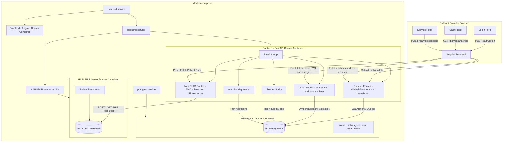

# PeritonealDialysisApp
Peritoneal Dialysis (PD) management application


1. Project Overview
The Peritoneal Dialysis (PD) Management App is designed to help patients and providers monitor and manage peritoneal dialysis treatment. The application allows patients to log their health data, provides analytics for trend monitoring, and enables providers to make informed treatment decisions based on notifications.

1.1 Features

•	Patient Module:

o	Input and track dialysis session details (weight, blood pressure, effluent volume).

o	Monitor trends and receive alerts for negative patterns.

o	Log daily meals and track protein intake.

•	Provider Module:

o	Dashboard to track patient data and identify high-risk cases.

o	View analytics and adjust treatment recommendations.

•	Security & Authentication:

o	OAuth2-based authentication with JWT.

o	Role-based access control (patients, providers).

•	Deployment:

o	backend (FastAPI).

o	Frontend built with React (Next.js).

o	PostgreSQL database.

o	Dockerized deployment.

2. API Contract


2.1 Authentication Endpoints

•	POST /auth/register – Register new users.

•	POST /auth/login – Authenticate users and return JWT.

•	POST /auth/logout – Invalidate session.

2.2 Patient Endpoints

•	POST /patients/{id}/dialysis-session – Log dialysis session.

•	GET /patients/{id}/dialysis-history – Retrieve dialysis history.

•	POST /patients/{id}/meal-log – Log meals and protein intake.

•	GET /patients/{id}/nutrition-summary – Get daily protein intake summary.

2.3 Provider Endpoints

•	GET /providers/dashboard – View all patients' status.

•	GET /patients/{id}/risk-analysis – Fetch analytics and flag high-risk cases.

•	PUT /patients/{id}/treatment-plan – Update treatment plan.

3. Database Schema (PostgreSQL)

3.1 Tables

-users

-dialysis_sessions

-food_intake


# To build and run the App locally:

Backend:

```
pip install -r requirements.txt

uvicorn app.api.main:app  --reload --host 0.0.0.0 --port 8004 --log-level debug


```

Frontend:

```
npm install
npm run build
npm run dev

``` 

Hapi FHIR Server:

```
running at:

http://localhost:8080
```

# To run the App as a Docker container:

- Assuming you have docker installed and setup on your machince.


```
to start the container run:

docker-compose up --build

to stop the container run:

docker-compose down

```


# Swagger Specs: http://localhost:8004/docs#/
# Backend APIs URL: http://localhost:8004/
# Frontend- React URL: http://localhost:3000/

# App URLs on the debian deployment server:

- Frontend
http://kidnekt.igortaskovski.com/login
 
- Backend
https://kidnekt-api.igortaskovski.com/docs
 
- Hapi FHIR
https://hapi.igortaskovski.com/


# Architecture flow diagram:



# Version control notes:
# Git Merge Workflow (main → test → stage)

This workflow ensures clean progression of code from development (`main`) to testing (`test`) and final staging (`stage`).

---

## 🔄 Merge Steps

### 1. Merge your feature branch into `main`
```sh
git checkout main          # Switch to main branch
git pull origin main       # Get latest changes
git merge <your-branch>    # Merge your work
git push origin main       # Push updated main
```

### 2. Merge `main` into `test`
```sh
git checkout test
git pull origin test
git merge main
git push origin test
```
### 3. Merge `test` into `stage`
```sh
git checkout stage
git pull origin stage
git merge test
git push origin stage
```
